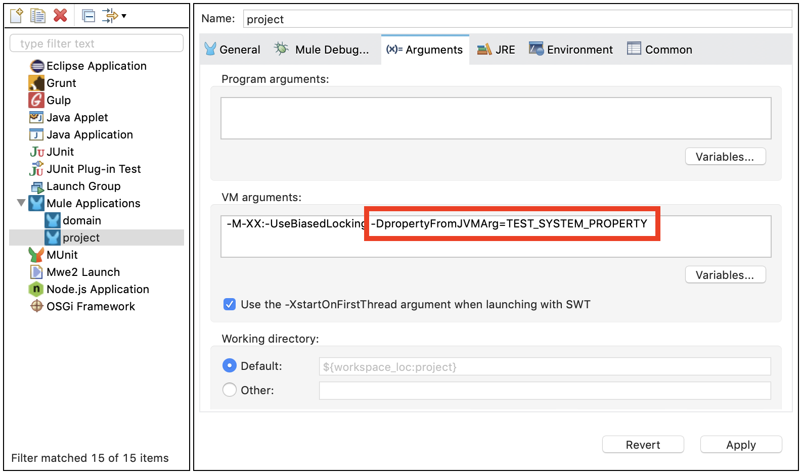

All Mule applications run under the Java Runtime Environment (JRE). Application components are built and deployed using Maven, a popular software management tool used in DevOps environments. MuleSoft also provides an Eclipse-based Integrated Development Environment (IDE) called Anypoint Studio, which is used for developing Mule applications in a graphical environment. While Studio can also be used for building, testing, and deploying applications, the instructions provided in the readme documentation of the projects assume the use of Maven from the command line, except where noted.

## Table of contents
1. [Software Requirements](#software-requirements)
1. [Workstation Setup](#workstation-setup)
1. [Running in Anypoint Studio](#running-in-anypoint-studio)


## Software Requirements

The MuleSoft Assets are built on Mule 4 and Studio 7. The following is a list of the minimum software requirements for working with Accelerator assets:

* Anypoint Studio 7.12.0 or higher
* Mule Runtime 4.4.0 or higher (included with Studio)
* Latest AdoptOpenJDK 8 release (included with Studio)
* Latest Maven 3.8.x release (for command-line deployments)
* Postman 9.x or higher (for API testing)

## Workstation Setup

Perform the following steps to prepare your workstation for building, deploying, and testing Mulesoft assets. These instructions assume some basic knowledge of using Maven and Eclipse-based products.

### Installing

- Download and install the latest 64-bit version of the OpenJDK 8 release from [https://adoptopenjdk.net](https://adoptopenjdk.net)
   . On Windows, add or update the `JAVA_HOME` environment variable to point to the installation root directory, for example `C:\Program Files\Java\jdk1.8.0_265`, and append `%JAVA_HOME%\bin` to the `PATH` variable.
- Download and install the latest Apache Maven 3.8.x release from [http://maven.apache.org/download.cgi](http://maven.apache.org/download.cgi) . Add or update the `MAVEN_HOME` environment variable to point to the installation root directory, for example `C:\Utilities\apache-maven-3.8.4`, and append `%MAVEN_HOME%\bin` (`$MAVEN_HOME/bin` on Linux/MacOS) to the `PATH` variable.
- Download and install the latest 64-bit version of the Anypoint Studio 7 release from [https://www.mulesoft.com/lp/dl/studio](https://www.mulesoft.com/lp/dl/studio). Do not install the product under a folder containing spaces in the name.
- Launch Studio and create a new workspace for the accelerator assets. Do not locate the workspace under a folder containing spaces in the name.

## settings.xml File

Contains global settings for your Maven installation. Unlike a project’s pom.xml, it defines system-wide settings and is not distributed with a project, since it can contain confidential information such as authentication credentials.

The settings.xml file can reside in two locations:

### In a system-wide settings folder:

In this case, it is a global settings.xml file that defines the settings for all Maven installations on the system, regardless of user. For example:

/etc/maven2/settings.xml


### In a user-specific settings folder:

In this case, it is a user settings.xml file that is relevant only for a specific user’s Maven installation. The default location is the .m2 directory in the user’s home directory:

/home/joe/.m2/settings.xml


On a system with both global and user settings.xml files, the settings from both files become merged. In case there are duplicate settings, the user’s settings take precedence over the global settings.

Copy the next settings file into your local system

```xml
<?xml version="1.0" encoding="UTF-8"?>
<settings xmlns="http://maven.apache.org/SETTINGS/1.0.0" xmlns:xsi="http://www.w3.org/2001/XMLSchema-instance" xsi:schemaLocation="http://maven.apache.org/SETTINGS/1.0.0                         http://maven.apache.org/xsd/settings-1.0.0.xsd">
   <activeProfiles>
      <activeProfile>mulesoft</activeProfile>
   </activeProfiles>
   <profiles>
      <profile>
         <id>mulesoft</id>
         <repositories>
            <repository>
               <id>anypoint-exchange-v3</id>
               <name>Assets for your anypoint organization</name>
               <url>https://maven.anypoint.mulesoft.com/api/v3/maven/</url>
            </repository>
            <repository>
               <snapshots>
                  <enabled>false</enabled>
               </snapshots>
               <id>central</id>
               <name>maven-central</name>
               <url>https://repo1.maven.org/maven2/</url>
            </repository>
            <repository>
               <id>mulesoft-releases</id>
               <name>mulesoft-releases</name>
               <url>https://repository-master.mulesoft.org/releases/</url>
            </repository>
            <repository>
               <id>mulesoft-snapshots</id>
               <name>MuleSoft Snapshot Repository</name>
               <url>https://repository-master.mulesoft.org/snapshots/</url>
            </repository>
            <repository>
               <id>mulesoft-enterprise-repository</id>
               <name>MuleSoft Enterprise Repository</name>
               <url>https://repository.mulesoft.org/nexus-ee/content/repositories/releases-ee/</url>
            </repository>
            <repository>
               <id>mulesoft-nexus-public</id>
               <name>Mulesoft Nexus Public Repository</name>
               <url>https://repository.mulesoft.org/nexus/content/repositories/public</url>
               <layout>default</layout>
            </repository>
         </repositories>
         <pluginRepositories>
            <pluginRepository>
               <id>mulesoft-plugins</id>
               <name>Mulesoft plugins-release</name>
               <url>https://repository.mulesoft.org/nexus/content/repositories/public/</url>
            </pluginRepository>
            <pluginRepository>
               <id>central-plugins</id>
               <name>plugins-release</name>
               <url>https://repo1.maven.org/maven2</url>
            </pluginRepository>
            <pluginRepository>
               <id>mulesoft-snapshots</id>
               <name>MuleSoft Snapshot Repository</name>
               <url>https://repository-master.mulesoft.org/snapshots/</url>
            </pluginRepository>
            <pluginRepository>
               <id>mulesoft-plugins-release</id>
               <name>Mulesoft plugins-release</name>
               <url>https://repository.mulesoft.org/releases/</url>
               <snapshots>
                  <enabled>false</enabled>
                  <updatePolicy>always</updatePolicy>
                  <checksumPolicy>fail</checksumPolicy>
               </snapshots>
            </pluginRepository>
         </pluginRepositories>
      </profile>
   </profiles>
   <servers>
      <server>
         <id>anypoint-exchange-v3</id>
         <username>~~~Client~~~</username>
         <password>AAAAAAAAAAAAA~?~BBBBBBBBBBBBB</password>
      </server>
      <server>
         <id>mulesoft-enterprise-repository</id>
         <username>MYUSER</username>
         <password>MYPASSWORD</password>   
      </server>
   </servers>
   <mirrors />
   <pluginGroups />
   <proxies />
</settings>
```

Get from your System Administrator the next tokens:

- Connected app for developers
- User/password for nexus repository. This is requiered only for running test cases from command line, it is not needed if run test cases inside of the Anypoint Studio IDE

## Importing projects in Anypoint Studio

Import a Mule Project from Exchange - https://docs.mulesoft.com/studio/7.15/import-project-exchange

Import a project from a jar file with sources or from a file system (for example, a github repository cloned in local system) - https://docs.mulesoft.com/studio/7.15/import-export-packages#import-projects-to-studio


## Running a project in Anypoint Studio

The real values for the configuration of the application will be set through the system properties in Anypoint Studio.

You can add properties when you launch your project on Anypoint Studio, through the Run Configurations menu:

1. Right-click your project in Package Explorer.

1. Click Run As > Run Configurations.

1. Pick the Arguments tab.

1. Add your arguments to the VM arguments field, preceding property names with -D:




Take the properties from the configuration section the README.md file of the application, example:

```bash
-M-XX:-UseBiasedLocking 
-M-Dfile.encoding=UTF-8 
-M-XX:+UseG1GC 
-M-XX:+UseStringDeduplication
-M-Dftp.username=myusername
-M-Dftp.password=user@fakegmail.com
-M-Dftp.host=myhost
```