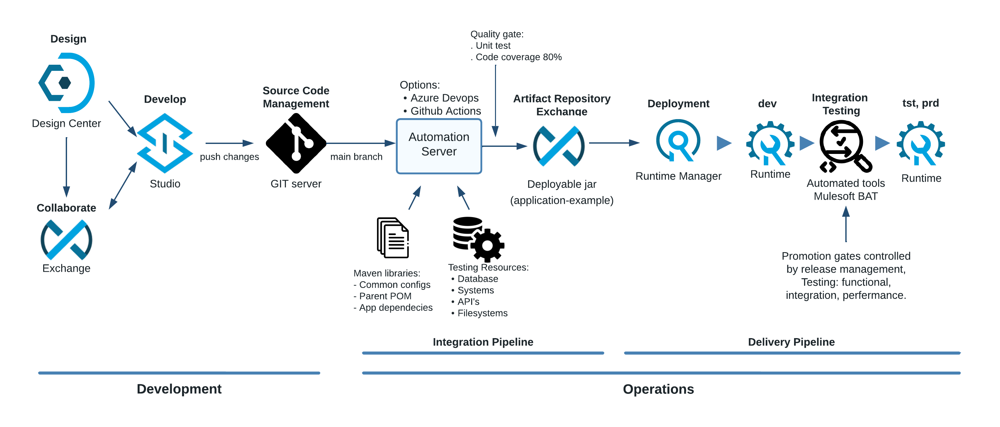

# Mulesoft Development Process

This guide will give you the best practices to apply when building a Mule application and help you configure your local build environment to ensure success in downloading, modifying, and deploying Mulesoft assets.

The [twelve-factor app](https://12factor.net/) guides the principles in this document.

## The Development and DevOps approach
A successful DevOps approach drives greater cooperation between the development and operations teams. This cooperation typically leads to shorter software development lifecycles while maintaining the stability of applications and target platforms. In most IT organizations, development and operations teams work in isolation: the development team designs and implements a solution and then “flips it over the wall” to the operations team for deployment, release management and maintenance. The development team must deliver solutions based on business needs while also ensuring those solutions are flexible to ever-changing business requirements. In contrast, the operations team manages these solutions so that they remain stable, reliable, and available.

While the objectives of both teams may be different, they still work with the same artifacts and typically utilize common toolsets. A lack of communication between these teams can result in a duplication of effort, process inefficiencies, and a greater number of software defects. As a result, project delivery timelines can suffer delays due to quality issues, scope creep, and defective releases. Establishing a solid DevOps approach facilitates greater team collaboration, quicker release cycles, and better overall software quality.

The Mule applications are released through the CICD pipeline, next image shows the architecture

We placed continuous integration front and center in a developer's workflow. For Mulesoft applications, We embrace a TBD (Trunk based development) approach for most projects. Only one code branch: main. We rely on 100% automation testing. For projects with complex features that require longer development times or multiple developers working in the same repository, please break the project into small pieces. This approach adheres to the principles of [API led architecture](https://blogs.mulesoft.com/learn-apis/api-led-connectivity)

Other sources:
- [What Is API-led Connectivity? Unlock Business Agility](https://www.salesforce.com/blog/api-led-connectivity)
- Check the page `API-led architecture` on this documentation for a summary

## Trunk Based Development principles

Trunk Based Development (TBD) is based on a set of principles that guide the development process and the management of the main codebase's trunk (main branch). These principles are designed to promote collaboration, code quality, rapid iteration, and efficient development practices. Here are the key principles behind Trunk Based Development:

1. **Maintain a Single Main Branch:** The main codebase has a single, authoritative branch known as the "trunk" or "main" branch. This branch is always kept in a deployable state, ensuring that the codebase is functional and ready for deployment at any time.

2. **Short-Lived Branches:** Developers create short-lived branches for specific features, fixes, or tasks. These branches are kept as small and focused as possible, and their lifespan is limited to a short period, often just a few hours or days.

3. **Frequent Integration:** Developers frequently integrate their changes into the main branch. The goal is to reduce the time between code changes and their integration, minimizing the risk of integration issues and merge conflicts.

4. **Continuous Integration and Automated Testing:** Automated tests are an essential part of TBD. Code changes are subject to automated tests to ensure that they meet quality standards and do not introduce regressions.

5. **Small Incremental Changes:** Developers aim to make small, incremental changes to the codebase. This approach reduces the complexity of code reviews, testing, and integration, making it easier to maintain a stable and functional trunk.

6. **Code Reviews:** All code changes are subject to code reviews before being merged into the main branch. Code reviews help maintain code quality, catch potential issues, and ensure that the codebase adheres to established standards.

7. **Feature Flags/Toggles:** Feature flags (also known as feature toggles) are used to hide incomplete or experimental features from users. This allows developers to merge code into the trunk while keeping features hidden until they are fully ready for release.

8. **Continuous Deployment:** TBD often aligns with continuous deployment practices, where changes that pass automated tests are automatically deployed to production environments. This enables rapid and frequent releases to end-users.

9. **Open and Collaborative Culture:** TBD encourages open communication and collaboration among team members. Developers share code early and often, and everyone works together to ensure the stability and quality of the main codebase.

10. **Solve Conflicts Early:** Developers resolve conflicts and integration issues as soon as they arise, rather than allowing them to accumulate. This approach prevents complex and time-consuming merge conflicts.

11. **Metrics and Monitoring:** TBD emphasizes the use of metrics and monitoring to track the health and performance of the main codebase, as well as the impact of changes on users and systems.

12. **Adapt and Evolve:** TBD is not a rigid process; it can be adapted to suit the needs of the team and the project. Regular retrospectives and feedback loops help the team continuously improve their development practices.

These principles collectively contribute to the goals of Trunk Based Development: faster development cycles, improved collaboration, reduced integration challenges, and the ability to deliver high-quality software to users more frequently.

